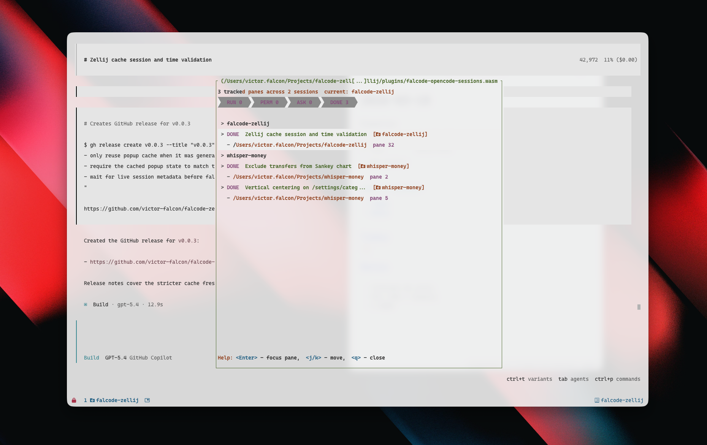

# falcode-zellij

A Zellij plugin that shows all active [OpenCode](https://opencode.ai) sessions across your Zellij sessions in a floating popup. Jump to any agent pane with a single keystroke.



> This plugins works really good with the [https://github.com/victor-falcon/git-worktree-zellij](git-worktree-zellij). Create and delete worktrees with a really simple cli.

## Installation

The plugin has two parts:

1. **Zellij WASM plugin** - the floating popup UI
2. **OpenCode plugin** - reports each pane's status and installs the editable detection script in the shared state directory

### 1. Download the Zellij plugin

Download `falcode-zellij-sessions.wasm` from the [latest release](https://github.com/victor-falcon/falcode-zellij/releases/latest) and place it in your Zellij plugins directory:

```bash
mkdir -p ~/.config/zellij/plugins
curl -L https://github.com/victor-falcon/falcode-zellij/releases/latest/download/falcode-zellij-sessions.wasm \
  -o ~/.config/zellij/plugins/falcode-zellij-sessions.wasm
```

### 2. Install the OpenCode plugin

Copy `falcode.js` to your OpenCode plugins directory:

```bash
mkdir -p ~/.config/opencode/plugins
curl -L https://raw.githubusercontent.com/victor-falcon/falcode-zellij/main/opencode-plugin/falcode.js \
  -o ~/.config/opencode/plugins/falcode.js
```

Then register it in `~/.config/opencode/config.json`:

```json
{
  "$schema": "https://opencode.ai/config.json",
  "plugin": [
    "./plugins/falcode.js"
  ]
}
```

If you already have a `config.json`, just add `"./plugins/falcode.js"` to the existing `plugin` array.

## Configuration

Add a keybinding to your Zellij config (`~/.config/zellij/config.kdl`) to launch the plugin as a floating pane:

```kdl
keybinds {
    shared {
        bind "Alt o" {
            LaunchOrFocusPlugin "file:~/.config/zellij/plugins/falcode-zellij-sessions.wasm" {
                floating true
                state_dir "__YOUR_HOME_DIR__/.local/state/falcode-zellij"
            }
        }
    }
}
```

> **Note:** Zellij does not expand `~` or `$HOME` in plugin config values. Replace `__YOUR_HOME_DIR__` with your actual home directory (e.g. `/home/jane` on Linux, `/Users/jane` on macOS). You can get it by running `echo $HOME`.

The `state_dir` must match the directory where the OpenCode plugin writes session state. The default is `~/.local/state/falcode-zellij`.

When the OpenCode plugin starts, it also creates `detect-active-opencode.sh` and `detect-active-opencode.default.sh` inside that `state_dir`. The popup calls `detect-active-opencode.sh` to get the active pane list as JSON, so you can tweak detection logic there without rebuilding the WASM plugin.

- Edit `~/.local/state/falcode-zellij/detect-active-opencode.sh` to customize detection locally.
- `detect-active-opencode.default.sh` is the bundled reference copy that gets refreshed automatically.
- Your customized `detect-active-opencode.sh` is only created once and is not overwritten afterward.

### Configuration options

| Option | Description | Default |
|---|---|---|
| `state_dir` | Absolute path to the shared state directory | _(required)_ |
| `state_file` | Name of the legacy state file | `opencode-sessions.json` |

The popup now requests Zellij's `Run commands` permission as well, because it executes the detection shell script on the host.

## Usage

| Key | Action |
|---|---|
| `j` / `Down` | Move selection down |
| `k` / `Up` | Move selection up |
| `Enter` | Focus the selected pane (switches session if needed) |
| `q` / `Esc` | Close the popup |

## Development

Build from source:

```bash
rustup target add wasm32-wasip1
cargo build --release --target wasm32-wasip1
```

The compiled plugin will be at `target/wasm32-wasip1/release/falcode-zellij-sessions.wasm`.

### Automated local install

For development, the install script builds the WASM plugin, symlinks both plugins into their expected locations, and registers the OpenCode plugin in your config:

```bash
python3 scripts/install.py
```

## License

MIT
