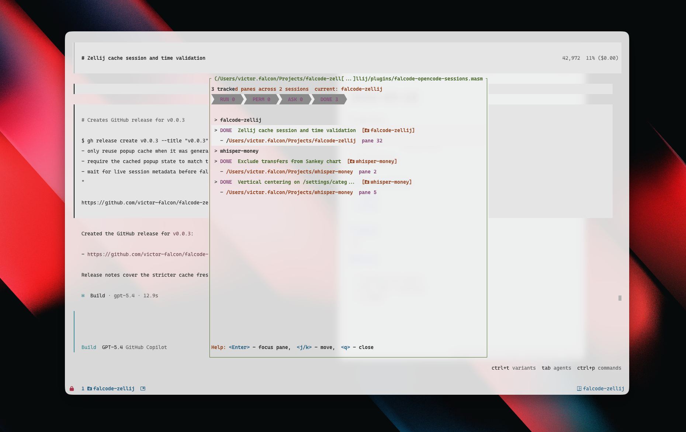

# falcode-zellij

A Zellij plugin that shows all active AI agent panes across your Zellij sessions in a floating popup. It currently supports [OpenCode](https://opencode.ai), [pi](https://pi.dev), and Claude-detected panes. Jump to any agent pane with a single keystroke.



> This plugins works really good with the [https://github.com/victor-falcon/git-worktree-zellij](git-worktree-zellij). Create and delete worktrees with a really simple cli.

## Installation

The plugin has two parts:

1. **Zellij WASM plugin** - the floating popup UI
2. **A session reporter** - either the OpenCode plugin and/or the pi extension, which report each pane's status and install the editable detection script in the shared state directory

### 1. Download the Zellij plugin

Download `falcode-zellij-sessions.wasm` from the [latest release](https://github.com/victor-falcon/falcode-zellij/releases/latest) and place it in your Zellij plugins directory:

```bash
mkdir -p ~/.config/zellij/plugins
curl -L https://github.com/victor-falcon/falcode-zellij/releases/latest/download/falcode-zellij-sessions.wasm \
  -o ~/.config/zellij/plugins/falcode-zellij-sessions.wasm
```

### 2a. Install the OpenCode plugin

Copy `falcode.js` to your OpenCode plugins directory:

```bash
mkdir -p ~/.config/opencode/plugins
curl -L https://raw.githubusercontent.com/victor-falcon/falcode-zellij/main/opencode-plugin/falcode.js \
  -o ~/.config/opencode/plugins/falcode.js
```

Then register it in `~/.config/opencode/config.json`:

```json
{
  "$schema": "https://opencode.ai/config.json",
  "plugin": [
    "./plugins/falcode.js"
  ]
}
```

If you already have a `config.json`, just add `"./plugins/falcode.js"` to the existing `plugin` array.

### 2b. Install the pi extension

Copy `falcode.ts` to your pi extensions directory:

```bash
mkdir -p ~/.pi/agent/extensions
curl -L https://raw.githubusercontent.com/victor-falcon/falcode-zellij/main/pi-extension/falcode.ts \
  -o ~/.pi/agent/extensions/falcode.ts
```

Then restart pi or run `/reload` inside pi.

### 2c. Install the notification helper script

If you want macOS click-to-focus notifications, also install the helper script into the shared state directory:

```bash
mkdir -p ~/.local/state/falcode-zellij
curl -L https://raw.githubusercontent.com/victor-falcon/falcode-zellij/main/scripts/oc-notify.sh \
  -o ~/.local/state/falcode-zellij/oc-notify.sh
chmod +x ~/.local/state/falcode-zellij/oc-notify.sh
```

## Configuration

Add a keybinding to your Zellij config (`~/.config/zellij/config.kdl`) to launch the plugin as a floating pane:

```kdl
keybinds {
    shared {
        bind "Alt o" {
            LaunchOrFocusPlugin "file:~/.config/zellij/plugins/falcode-zellij-sessions.wasm" {
                floating true
                state_dir "__YOUR_HOME_DIR__/.local/state/falcode-zellij"
            }
        }
    }
}
```

> **Note:** Zellij does not expand `~` or `$HOME` in plugin config values. Replace `__YOUR_HOME_DIR__` with your actual home directory (e.g. `/home/jane` on Linux, `/Users/jane` on macOS). You can get it by running `echo $HOME`.

The `state_dir` must match the directory where your reporter writes session state. The default is `~/.local/state/falcode-zellij`.

When the OpenCode plugin or pi extension starts, it also creates `detect-active-opencode.sh` and `detect-active-opencode.default.sh` inside that `state_dir`. The popup calls `detect-active-opencode.sh` to get the active pane list as JSON, so you can tweak detection logic there without rebuilding the WASM plugin.

- Edit `~/.local/state/falcode-zellij/detect-active-opencode.sh` to customize detection locally.
- `detect-active-opencode.default.sh` is the bundled reference copy that gets refreshed automatically.
- Your customized `detect-active-opencode.sh` is only created once and is not overwritten afterward.

### Configuration options

| Option | Description | Default |
|---|---|---|
| `state_dir` | Absolute path to the shared state directory | _(required)_ |
| `state_file` | Name of the legacy state file | `opencode-sessions.json` |

The popup now requests Zellij's `Run commands` permission as well, because it executes the detection shell script on the host.

### Notification debug logs

If a macOS notification click does not focus the expected pane/session, check:

- `~/.local/state/falcode-zellij/notification-clicks.log` — notification creation + click/focus attempts, including zellij command output and post-checks.
- `~/.local/state/falcode-zellij/terminal-notifier.log` — raw `terminal-notifier` output.

## Usage

| Key | Action |
|---|---|
| `1`-`9` | Jump directly to the numbered pane |
| `j` / `Down` | Move selection down |
| `k` / `Up` | Move selection up |
| `Enter` | Focus the selected pane (switches session if needed) |
| `q` / `Esc` | Close the popup |

## Development

Build from source:

```bash
rustup target add wasm32-wasip1
cargo build --release --target wasm32-wasip1
```

The compiled plugin will be at `target/wasm32-wasip1/release/falcode-zellij-sessions.wasm`.

### Automated local install

For development, the install script builds the WASM plugin, symlinks the OpenCode plugin, the pi extension, the detection script, and the notification helper into their expected locations, and registers the OpenCode plugin in your config:

```bash
python3 scripts/install.py
```

## License

MIT
